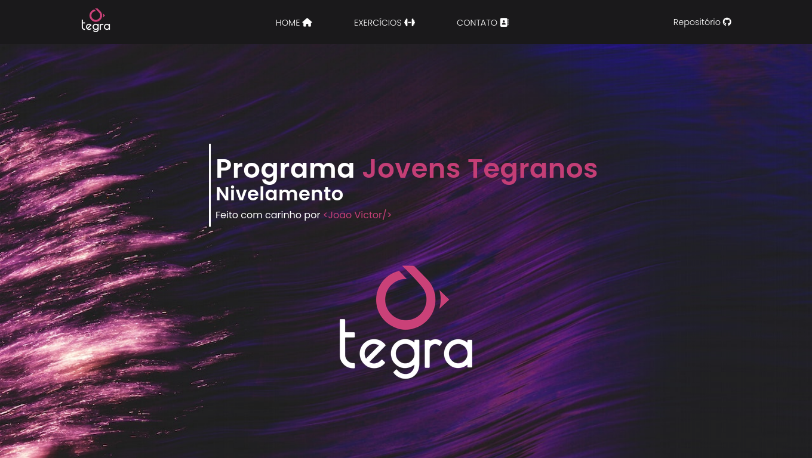

<h1 align="center"> Jovens Tegranos </h1>

  <a href="#-tecnologias">Tecnologias</a>&nbsp;&nbsp;&nbsp;|&nbsp;&nbsp;&nbsp;
  <a href="#-projeto">Projeto</a>

  

 

  

## 🚀 Tecnologias

Esse projeto foi desenvolvido com as seguintes tecnologias:

- HTML
- CSS
- Javascript

## 💻 Projeto

Exercícios de lógica de programaço do programa Jovens Tegranos

Originalmente o projeto seria uma SPA, porém ao longo do desenvolvimento foi alterado para o modelo MPA, com diversas páginas HTML.
Essa escolha foi necessária dado que para desenvolver uma SPA, mesmo em Javascript Vanilla, seria necessário algum serviço que subisse a aplicação em um servidor local, como o Browser Sync ou Vite. Como o programa Jovens Tegranos especifica a utilização de HTML, CSS e Javascript, optei por seguir essa regra à risca.

---
